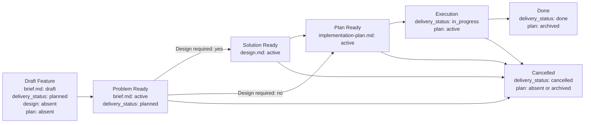

# Feature Flow

This document defines the order in which feature artifacts appear. The agent must advance a feature package through stages and must not create downstream artifacts before their upstream owner is ready.

## Package Rules

1. All documents for one feature live in `memory-bank/features/FT-XXX/`.
2. **Feature = vertical slice.** One feature — one unit of user value that cuts through all affected system layers (UI, API, storage, infra). Horizontal slicing ("all endpoints", "all UI") is allowed only for purely infrastructural or refactoring tasks and must be explicitly justified via `NS-*`.
3. `brief.md` — canonical owner of problem space: problem, outcome, scope, non-scope, assumptions, constraints, unresolved blocking decisions, and the canonical verify contract of the delivery unit.
4. `design.md` — conditional canonical owner of solution space. It is created only when the feature requires explicit design reasoning: selected design, C4/design decision, accepted feature-local decisions, contracts, invariants, failure modes, rollout/backout, or references to accepted ADRs.
5. `README.md` is created together with `brief.md` and remains the routing layer throughout the lifecycle.
6. The lifecycle owner for `delivery_status` is only the canonical `brief.md`. `design.md`, feature-level `README.md`, and `implementation-plan.md` do not duplicate this field.
7. `design.md` appears only after `Problem Ready` and only if `brief.md` records `Design required: yes`.
8. `implementation-plan.md` is a derived execution document. In new feature packages it must not exist until upstream owners are ready: `brief.md` is active and, if design is required, `design.md` is active.
9. For canonical `brief.md`, canonical `design.md`, feature-level `README.md`, and `implementation-plan.md` use wrapper templates from `memory-bank/flows/templates/feature/`: the template file itself has `doc_function: template`, and the frontmatter/body of the document to be instantiated live inside the embedded template contract.
10. The meaning of stable identifiers (`REQ-*`, `SOL-*`, `SD-*`, `STEP-*`, etc.) is defined in the "Stable Identifiers" section below.
11. Acceptance scenarios (`SC-*`) cover the vertical slice end-to-end: from the input event to the observable result through all affected layers. Testing an individual layer in isolation is acceptable as an implementation detail of the plan but does not replace end-to-end acceptance.
12. **Link to task tracker.** When creating a feature package, the agent must add a link to `brief.md` to the source task or ticket, and after downstream documents appear — links to existing `design.md` and `implementation-plan.md`.
13. If a feature is part of a larger initiative, `brief.md` may depend on a PRD from `memory-bank/prd/`, but the PRD does not replace the feature package itself.
14. If a feature creates a new stable project scenario or materially changes an existing one, the corresponding `UC-*` in `memory-bank/use-cases/` must be created or updated before closure.
15. Optional feature support docs (`runtime-surfaces.md`, `ui-reference/README.md`, `use-cases/README.md`) are acceptable for complex features as grounding/review/traceability aids. They do not become canonical owners of problem space, solution space, acceptance inventory, or execution sequencing.
16. If a feature depends on an upstream initiative document, `brief.md` imports only relevant upstream references, not the entire upstream scope.
17. If the work is larger than one delivery feature and requires a roadmap, risk register, or multiple delivery units, do not extend the feature package; choose the appropriate upstream flow from `memory-bank/flows/` and manage each approved delivery unit as a separate feature package.

## `brief.md` Template

New feature packages use one problem-space template: `memory-bank/flows/templates/feature/brief.md`.

`brief.md` scales with content:

- A compact feature fills the minimal set of `REQ-*`, `NS-*`, `SC-*`, `CHK-*`, `EVID-*`.
- A complex problem-space part adds `MET-*`, `ASM-*`, `CON-*`, `DEC-*`, `NEG-*`, multiple acceptance scenarios, richer traceability, and an evidence contract.
- Solution-space complexity does not extend `brief.md`; use the sibling `design.md` for the selected approach, contracts, C4, failure modes, and rollout/backout.

If the problem space is complex, extend the same `brief.md` with content rather than choosing a different template.

## When `design.md` Is Needed

`brief.md` must record the **Design Requirement Decision** before transitioning to `Problem Ready`: `Design required: yes/no` and a brief reason. This is not the selected design — it is the gate decision for choosing the downstream path.

`design.md` is required if at least one condition is met:

1. The feature changes an API, event, schema, file format, CLI, env/config contract, background job topology, queue/storage boundary, security boundary, financial calculation, integration contract, or operational rollout.
2. The solution requires alternatives/trade-off reasoning, ADR dependency, C4/data-flow diagram, migration strategy, rollout/backout design, or explicit failure-mode design.
3. `implementation-plan.md` would otherwise have to make architecture decisions, contracts, or invariants before laying out steps.
4. The feature has a design pack of multiple artifacts; `design.md` must index them and specify the owner of each design fact.

If the change remains local, does not change a runtime/interface/contract boundary, and the solution is obvious from existing patterns, `design.md` can be omitted. In that case `brief.md` records `Design required: no` and the reason; `implementation-plan.md` must not invent solution facts.

## C4 Analysis Requirements

If `design.md` is required, it must record a **C4 applicability decision** before `Solution Ready`: which minimum C4 level is needed, or why C4 is not needed. The goal is not to draw diagrams for their own sake, but to explicitly check architecture boundaries before the execution plan.

### When C4 Is Not Needed

C4 can be omitted if the change simultaneously:

1. Remains inside one already-existing component/module.
2. Does not change an API/event/schema/file format/env/queue/storage/integration/security boundary.
3. Does not introduce a new runtime/deployable/container or new background execution path.
4. Does not redistribute responsibility between bounded contexts, engines, services, or external systems.

In that case `design.md` records `C4-00: not required` and a brief reason.

### Minimum C4 Level

| Trigger in design analysis | Required C4 level | What to show |
| --- | --- | --- |
| User, external system, external API, payment/fiscal/KYT/AML/provider integration, or trust boundary with the system changes | C1 System Context | System, actor/external systems, direction of interaction, trust/data boundary |
| Runtime/deployable/container boundary changes: frontend/backend, app/worker, queues, cache/storage, Docker/Kubernetes/CI | C2 Container | Containers/runtime nodes, data stores, queues, protocols, ownership of data flow |
| Internal decomposition within one container changes: application services/readers/writers, orchestration, state machine, domain module split, shared component boundary, financial/security-critical collaboration | C3 Component | Components/modules inside the container, responsibilities, call/event/data direction |
| Class-level design must be explained as an architecture decision: framework extension, reusable library contract, non-trivial algorithm object graph, concurrency/locking primitive | C4 Code | Only critical classes/interfaces and relationships; do not use for ordinary CRUD/service changes |

If a trigger falls into multiple rows, choose the deepest required level and maintain traceability to higher boundaries.

### C4 Artifact Rules

1. A C4 artifact may be Mermaid, PlantUML, Structurizr DSL, an image, or a markdown table, provided it unambiguously conveys the chosen C4 level.
2. A C4 artifact is part of the design pack and is indexed from `design.md`.
3. A C4 artifact must not contain execution steps, file-level TODOs, or test commands.
4. If a C4 level is required, `Solution Ready` is not achievable without the artifact or a reference to an existing canonical C4/design artifact covering the affected boundary.

## Optional Feature Support Docs

Support docs are created only when they remove real ambiguity or make review substantially more accurate. They are `doc_kind: feature-support` and `doc_function: reference` / `index` unless explicitly justified otherwise.

| Support doc | When to create | What it captures | Does not own |
| --- | --- | --- | --- |
| `runtime-surfaces.md` | Feature touches multiple runtime entrypoints, concrete surfaces, semantic mappings, fallback/error paths, or context variants | Current surface inventory, semantic mapping, adjacent out-of-scope surfaces, target mapping reference, context matrix, resolution/decision table, observability notes | Requirements, selected design, acceptance criteria, implementation sequence |
| `ui-reference/README.md` | Feature changes the interface, authoring flow, navigation, screen states, or preview/editor UX | Generic interface reference: screen map, interaction states, component expectations, copy/state semantics, mockup links and UI traceability | Project-specific UI framework rules, product requirements, selected architecture, implementation steps |
| `ui-reference/mockups/*.md` or other linkable artifact | Any interface change requires at least a low-fidelity mockup; default format — Markdown, but images, design-tool links, or other artifacts are allowed if they are versionable/linkable | Screen sketch, state examples, interaction notes | Canonical acceptance inventory or final visual design system |
| `use-cases/README.md` | Many scenarios, distinct happy/edge/error journeys, multiple user roles, or a review-friendly `FUC -> REQ -> CHK` mapping is needed | Derived user-facing scenarios, edge/error cases, candidate test cases, traceability back to canonical refs | Canonical `SC-*`, `NEG-*`, `CHK-*`, `EVID-*` |

Support docs must reference canonical owners and explicitly state that they do not substitute for `brief.md`, `design.md`, or `implementation-plan.md`. If a support doc discovers a change to scope, acceptance, selected design, or execution sequence, the corresponding canonical owner is updated first.

## Migration Strategy

- New feature packages must immediately follow the `brief.md -> optional design.md -> implementation-plan.md` structure.
- When migrating an old package layout, first assign canonical owners: problem-space content moves into `brief.md`, required solution-space content moves into `design.md`.
- After migration a package must not retain duplicate active owners for problem space or solution space.
- Migration may happen gradually, package by package.

## Lifecycle

## Transition Gates

Each gate is a set of verifiable predicates. A transition is allowed only when all predicates are true.

### Bootstrap Feature Package

- [ ] `README.md` created from template `templates/feature/README.md`
- [ ] `brief.md` created from template `templates/feature/brief.md`
- [ ] `design.md` absent
- [ ] `implementation-plan.md` absent

### Draft Feature → Problem Ready

- [ ] `brief.md` → `status: active`
- [ ] `What` section contains ≥ 1 `REQ-*` and ≥ 1 `NS-*`
- [ ] `Verify` section contains ≥ 1 `SC-*`
- [ ] each `REQ-*` traces to ≥ 1 `SC-*` via traceability matrix
- [ ] `Verify` section contains ≥ 1 `CHK-*` and ≥ 1 `EVID-*`
- [ ] if the deliverable cannot be accepted without negative/edge coverage → ≥ 1 `NEG-*`
- [ ] `brief.md` contains Design Requirement Decision: `Design required: yes/no` and reason
- [ ] `brief.md` does not contain accepted solution decisions, `How`, to-be C4 architecture model, `Change Surface`, solution-level `Flow`, `CTR-*`, `FM-*`, `RB-*`, or rollout/backout prose

### Problem Ready → Solution Ready

- [ ] `brief.md` records `Design required: yes`
- [ ] `design.md` created from template `templates/feature/design.md`
- [ ] `design.md` → `status: active`
- [ ] `design.md` contains ≥ 1 `SOL-*`
- [ ] `design.md` references at least one canonical `REQ-*` from sibling `brief.md`
- [ ] `design.md` records C4 applicability decision; if a C4 level is required, a C4 artifact or reference to a canonical C4/design artifact is present in the design pack
- [ ] selected design is stable enough that downstream execution sequencing no longer competes with it for ownership
- [ ] accepted feature-local decisions moved to `SD-*`; architectural/reusable/cross-feature decisions formalized in accepted ADR
- [ ] if the solution depends on an ADR, that ADR has `decision_status: accepted`
- [ ] for a new feature package `implementation-plan.md` is absent; for a migrated package with an existing plan, `design.md` may be created after which the plan must be updated to reference canonical solution refs before the next significant execution update

### Upstream Ready → Plan Ready

- [ ] agent has performed grounding: walked through the current state of the system (relevant paths, existing patterns, dependencies) and recorded the result in the discovery context section of `implementation-plan.md`
- [ ] if `brief.md` records `Design required: yes`, sibling `design.md` has `status: active`
- [ ] if `brief.md` records `Design required: no`, `implementation-plan.md` does not make architecture decisions, contracts, or invariants
- [ ] `implementation-plan.md` created from template `templates/feature/implementation-plan.md`
- [ ] `implementation-plan.md` → `status: active`
- [ ] `implementation-plan.md` contains ≥ 1 `PRE-*`, ≥ 1 `STEP-*`, ≥ 1 `CHK-*`, ≥ 1 `EVID-*`
- [ ] discovery context in `implementation-plan.md` contains: relevant paths, local reference patterns, unresolved questions (`OQ-*`), test surfaces, and execution environment
- [ ] steps and workstreams in `implementation-plan.md` reference canonical IDs from `brief.md` and, if the design layer exists, solution refs from `design.md` / ADR

### Plan Ready → Execution

- [ ] `brief.md` → `delivery_status: in_progress`
- [ ] if `design.md` exists, it has `status: active`
- [ ] `implementation-plan.md` → `status: active`
- [ ] `implementation-plan.md` records test strategy: automated coverage surfaces, required local/CI suites
- [ ] each manual-only gap has a reason, a manual procedure, and an `AG-*` with approval ref

### Execution → Done

- [ ] all `CHK-*` from `brief.md` have a pass/fail result in evidence
- [ ] all `EVID-*` from `brief.md` are filled with specific carriers (file path, CI run, screenshot)
- [ ] delivered behavior does not contradict accepted `SOL-*` / `SD-*` / ADR refs if the design layer exists
- [ ] automated tests for the change surface have been added or updated
- [ ] required test suites are green locally and in CI
- [ ] each manual-only gap has been explicitly approved by a human (approval ref in `AG-*`)
- [ ] simplify review completed: code is minimally complex or complexity is justified by reference to `CON-*`, `FM-*`, `SD-*`, or an accepted ADR
- [ ] if the feature adds a new stable flow or materially changes an existing project-level scenario, the corresponding `UC-*` has been created or updated and registered in `memory-bank/use-cases/README.md`
- [ ] `brief.md` → `delivery_status: done`
- [ ] `implementation-plan.md` → `status: archived`

### → Cancelled (from any stage after Draft Feature)

- [ ] `brief.md` → `delivery_status: cancelled`
- [ ] `implementation-plan.md` absent ∨ `status: archived`

## Boundary Rules

1. `brief.md` must contain sections `What` and `Verify`.
2. `brief.md` owns only problem space: problem, outcome, scope, non-scope, assumptions, constraints, unresolved blocking decisions, Design Requirement Decision, and canonical verify contract.
3. `brief.md` must not contain `How`, selected design, to-be C4 architecture model, accepted solution decisions, change surface, internal flow, concrete solution contracts, solution-level failure modes, rollout/backout semantics, or execution sequencing.
4. `DEC-*` in `brief.md` means only unresolved blocking decisions. Once a decision is made, it moves to `design.md` as `SD-*` or to an ADR.
5. `design.md`, if needed, owns only solution space: selected design, C4 applicability/artifacts, accepted feature-local decisions, solution structure, internal flow, concrete contracts, invariants, solution-level failure modes, local rollout/backout semantics, and references to accepted ADRs.
6. `delivery_status` stays only on `brief.md`; `design.md` and `implementation-plan.md` do not duplicate the lifecycle state of the delivery unit.
7. `design.md` must not redefine business requirements, scope, acceptance criteria, canonical checks, evidence contract, detailed current-system inventory, or execution sequencing.
8. Feature support docs must not redefine canonical facts. They may provide surface inventory, UI reference, mockups, derived use cases, and review mappings only as support context.
9. If a feature depends on an ADR, the canonical owner of that dependency is `design.md`; a `proposed` ADR is not considered a finalized design.
10. If a feature depends on a canonical use case, `brief.md` references the corresponding file in `memory-bank/use-cases/`. The use case remains the owner of trigger/preconditions/main flow/postconditions at the project level, and `brief.md` captures only the slice-specific problem and verify.
11. `implementation-plan.md` remains a derived execution document: it references canonical IDs from `brief.md` and, if available, solution refs from `design.md` / ADR, records discovery context and test strategy for execution, and does not redefine scope, selected design, C4 architecture model, blockers, acceptance criteria, or evidence contract.
12. If scope, assumptions, constraints, acceptance criteria, or evidence contract change, `brief.md` is updated first. If selected design, to-be C4 architecture model, locally accepted decisions, contracts, failure modes, or rollout/backout semantics change, `design.md` or the ADR is updated first. Only then is the downstream plan updated.
13. If a support doc reveals a conflict with a canonical owner, the conflict cannot be resolved inside the support doc: update `brief.md`, `design.md`, ADR, or `implementation-plan.md` by ownership.
14. If a numerical target threshold belongs to only one delivery unit, the canonical owner is the corresponding `brief.md`. Promoting such a KPI to a project-level document is allowed only after it has become a shared upstream fact for multiple features.
15. A good `implementation-plan.md` begins with discovery context: relevant paths, local reference patterns, unresolved questions, test surfaces, and execution environment must be recorded before sequencing changes.
16. For risky, irreversible, or externally-effective actions, `implementation-plan.md` must explicitly describe human approval gates and must not hide them inside step prose.
17. If a feature executes part of an upstream initiative, `brief.md` must reference only relevant upstream artifacts and imported IDs, not copy the entire upstream scope. If upstream solution decisions are used, `design.md` or ADR references their canonical owner.
18. Upstream roadmap, cross-feature risks, and delivery-unit registries belong to upstream owner documents, not to the feature package.

## Test Ownership Summary

The canonical testing policy lives in [../engineering/testing-policy.md](../engineering/testing-policy.md). Below is a summary sufficient for creating a feature package without consulting the policy document.

1. **Canonical test cases** for a delivery unit are defined in `brief.md` via `SC-*`, feature-specific `NEG-*`, `CHK-*`, and `EVID-*`.
2. `design.md`, if needed, may record solution-level `CTR-*`, `INV-*`, `FM-*`, and `RB-*`, but does not own the test strategy and does not replace the canonical verify contract.
3. `implementation-plan.md` owns only execution strategy: which suites to add, which gaps are temporarily manual-only and why.
4. **Sufficient coverage** = the main changed behavior is covered, new or changed contracts from `design.md` / ADR are covered, critical failure modes from `FM-*` are covered, and feature-specific negative/edge scenarios that change the verdict are covered. Line coverage percentage alone is insufficient.
5. **Manual-only is acceptable** only as an explicit exception (live infrastructure, hardware, non-deterministic environment). For each gap — a reason, a manual procedure or `EVID-*`, an owner follow-up, and an approval ref via `AG-*`.
6. **By Problem Ready** `brief.md` already records the test case inventory: at least one `SC-*`, traceability to `REQ-*`, and the Design Requirement Decision. **By Solution Ready** a required `design.md` records the delivered design, C4 applicability, contracts, and local decisions. **By Done** — automated tests have been added and required suites are green locally and in CI.
7. **Simplify review** — a separate pass after functional tests, before closure. Goal: ensure the code is minimally complex. Three similar lines are better than a premature abstraction. Complexity is justified only by reference to `CON-*`, `INV-*`, `FM-*`, `SD-*`, or an accepted ADR.
8. **Verification context separation** — functional verification, simplify review, and acceptance testing are three logically separate passes. The agent formulates conclusions before beginning the next pass. For small features all three may occur in one session, but the simplify review must not be skipped.

## Stable Identifiers

### Feature IDs

| Prefix | Meaning | Used in |
| --- | --- | --- |
| `MET-*` | Outcome metrics | `brief.md` |
| `REQ-*` | Scope and required capabilities | `brief.md` |
| `NS-*` | Non-scope | `brief.md` |
| `ASM-*` | Assumptions and working premises | `brief.md` |
| `CON-*` | Problem space constraints | `brief.md` |
| `DEC-*` | Unresolved blocking decisions | `brief.md` |
| `EC-*` | Exit criteria | `brief.md` |
| `SC-*` | Acceptance scenarios | `brief.md` |
| `NEG-*` | Negative / edge test cases | `brief.md` |
| `CHK-*` | Checks | `brief.md`, `implementation-plan.md` |
| `EVID-*` | Evidence artifacts | `brief.md`, `implementation-plan.md` |
| `RJ-*` | Rejection rules | `brief.md`, `implementation-plan.md` |

### Solution IDs

| Prefix | Meaning | Used in |
| --- | --- | --- |
| `SOL-*` | Solution elements / selected design blocks | `design.md` |
| `ALT-*` | Considered alternatives | `design.md` |
| `TRD-*` | Trade-offs | `design.md` |
| `C4-*` | C4 applicability decision, model levels, elements, or relationships | `design.md` |
| `SD-*` | Accepted feature-local solution decisions | `design.md` |
| `INV-*` | Solution invariants | `design.md` |
| `CTR-*` | Concrete solution contracts | `design.md` |
| `FM-*` | Solution-level failure modes | `design.md` |
| `RB-*` | Rollout / backout stages | `design.md` |

### Plan IDs

| Prefix | Meaning | Used in |
| --- | --- | --- |
| `PRE-*` | Preconditions | `implementation-plan.md` |
| `OQ-*` | Unresolved questions / ambiguities | `implementation-plan.md` |
| `WS-*` | Workstreams | `implementation-plan.md` |
| `AG-*` | Approval gates for risky actions | `implementation-plan.md` |
| `STEP-*` | Atomic steps | `implementation-plan.md` |
| `PAR-*` | Parallelizable blocks | `implementation-plan.md` |
| `CP-*` | Checkpoints | `implementation-plan.md` |
| `ER-*` | Execution risks | `implementation-plan.md` |
| `STOP-*` | Stop conditions / fallback | `implementation-plan.md` |

### Support IDs

| Prefix | Meaning | Used in |
| --- | --- | --- |
| `SURF-*` | Runtime surfaces / entrypoints / concrete render or processing surfaces | `runtime-surfaces.md` |
| `MAP-*` | Semantic mapping rows or mapping rules | `runtime-surfaces.md` |
| `UI-*` | Interface screens, states, controls, or interaction elements | `ui-reference/README.md` |
| `FUC-*` | Derived feature-local use cases | `use-cases/README.md` |
| `TC-*` | Derived test case candidates | `use-cases/README.md`, support docs |

### Required Minimum

1. Any canonical `brief.md` uses at least `REQ-*`, `NS-*`, `SC-*`, `CHK-*`, `EVID-*`.
2. Any `brief.md` with `status: active` defines at least one explicit test case via `SC-*`.
3. `brief.md` may use only the minimal problem-space set for a small feature or the extended set of feature IDs as needed; separate problem-space templates are not used.
4. Any required `design.md` uses at least one `SOL-*`, one `C4-*` decision, and links them to at least one `REQ-*` from the sibling `brief.md`.
5. Any `design.md` records the selection rationale for C4 applicability; chosen C4 views use `C4-*` and link to `SOL-*`, `SD-*`, `CTR-*`, `INV-*`, or ADR refs.
6. Any `design.md` that contains accepted feature-local decisions uses `SD-*`; `ALT-*`, `TRD-*`, `CTR-*`, `INV-*`, `FM-*`, and `RB-*` are used only when the corresponding solution semantics are genuinely needed.
7. Any optional support doc uses only local support IDs and traceability to canonical refs; it does not introduce new canonical `REQ-*`, `SC-*`, `CHK-*`, or `EVID-*`.
8. Any `implementation-plan.md` uses at least `PRE-*`, `STEP-*`, `CHK-*`, `EVID-*`; `OQ-*` and `AG-*` are used when ambiguity or human approval gates are present.

### Traceability Contract

1. Scope in `brief.md` is recorded via `REQ-*`, non-scope via `NS-*`.
2. Verify in `brief.md` links `REQ-*` to test cases via Acceptance Scenarios, feature-specific `NEG-*`, Traceability matrix, Test matrix, and Evidence contract.
3. `design.md`, if present, links `REQ-*` from `brief.md` to `SOL-*`, `ALT-*`, `TRD-*`, `C4-*`, `SD-*`, `CTR-*`, `INV-*`, `FM-*`, `RB-*`, and accepted ADR refs.
4. `implementation-plan.md` references canonical IDs from `brief.md` and, if present, solution refs from `design.md` / ADR in columns `Implements`, `Verifies`, and `Evidence IDs`.
5. If sequencing is blocked by an unknown, the plan records it as `OQ-*` rather than hiding it in prose.
6. If execution requires human confirmation for risky actions, the plan records this via `AG-*`.
7. If design or the to-be C4 architecture model changes after `Solution Ready`, `design.md` or the ADR is updated first, then the plan.
